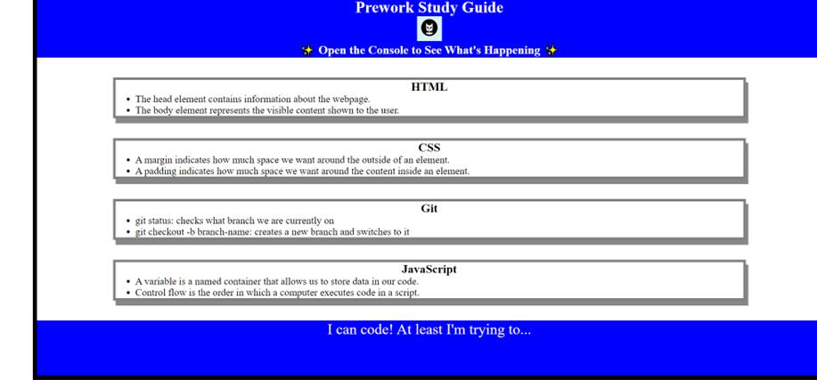

# <Your-Project-Title>

## Description

This Prework Study Guide was created for boot camp students who were going through the Prework. It contains notes on HTML, CSS, Git, and JavaScript. I was motivated to create this not only because the project forms part of my foundations in coding, but it also can be a great reference to look back on. As a result, I've learned the basics of CSS, JavaScript and HTML.

## Installation

N/A

## Usage

This Prework Study Guide was created for boot camp students who were going through the Prework. It contains notes on HTML, CSS, Git, and JavaScript.

## Credits

N/A

## License

Please refer to the LICENSE in the repo.
